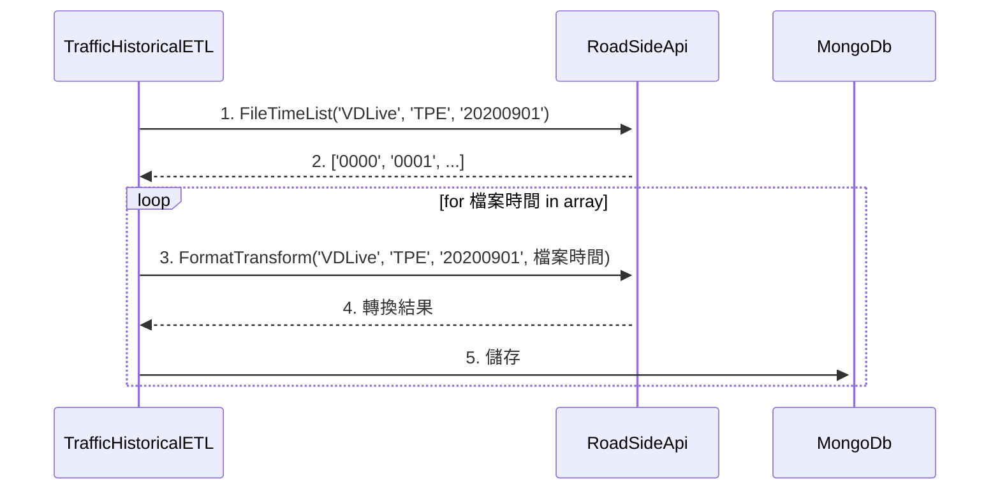

# 歷史補遺作業

## 規劃

[PPT](assets/%E6%AD%B7%E5%8F%B2%E8%A3%9C%E9%81%BA%E4%BD%9C%E6%A5%AD%E8%A6%8F%E5%8A%83.pptx)

## RoadSideApi

> [issue #6](https://gitlab.transportdata.tw/PTX/traffic/roadsidedataetl/roadsidedatav2etl/-/issues/6#note_56262)

- 條列路況資料指定[日期]、[業管機關]下所含括的檔案時間 (時間格式: HHmm)
  - Method: GET
  - API: [http://192.168.99.190:8888/RoadsideDataV2ETL/API/FileTimeList/VDLive/20200901?authorityCode=TPE](http://192.168.99.190:8888/RoadsideDataV2ETL/API/FileTimeList/VDLive/20200901?authorityCode=TPE)
  - Remark: 若資料不存在或資料夾為空則會取得空陣列回應
  - 後面用函式表示: `FileTimeList(資料型別, 業管機關, 日期)`
- 轉換指定[日期]、[時間]、[業管機關]的原始路況檔案 (時間格式: HHmm)
  - Method: GET
  - API: [http://192.168.99.190:8888/RoadsideDataV2ETL/API/FormatTransform/VDLive/20200901/0000?authorityCode=TPE&format=JSON](http://192.168.99.190:8888/RoadsideDataV2ETL/API/FormatTransform/VDLive/20200901/0000?authorityCode=TPE&format=JSON)
  - Remark: 與最早設計的 API 不同，一次僅能指定一個業管機關簡碼和一個轉換輸出格式
  - 後面用函式表示: `FormatTransform(資料型別, 業管機關, 日期, 時間)`

## TrafficHistoricalETL

